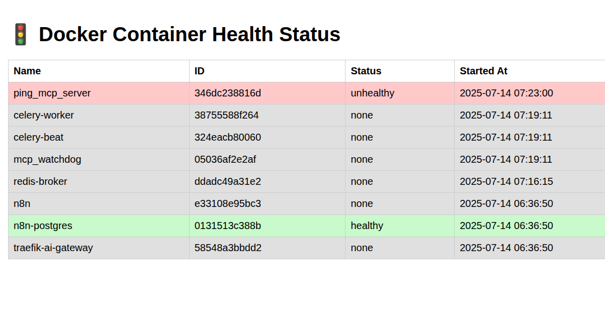

  <h1>Container Health Status Dashboard</h1>
  <h3 align="center">Docker Container Health Status and Celery Task to Restart Unhealthy Containers 🚀</h3>

<!-- ## Demo Video

 -->

# 📝 Documentation

# 📚 References

# 🤝🏻 Connect with Me

# 📜 License

Licensed under the GPL3 License, Copyright 2025 Huzaifa Irfan. [LICENSE](LICENSE)

Last Updated on 2025-07-14
